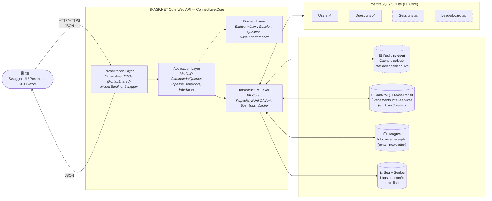

# Architecture — ConnectLive

> Document généré à partir d'une analyse complète du code (session Claude Code, 2026-09-22).
> Pour le détail fichier par fichier, le guide RabbitMQ/Hangfire/Seq et le sprint planning : voir l'[analyse complète](https://claude.ai/artifact/AHdiWMRQMd6TSDx79DCfFU).

## Schéma



*(Ce bloc `mermaid` s'affiche automatiquement sur GitHub, GitLab, et la plupart des viewers Markdown modernes — rien à installer.)*

---

## Les 4 couches

| Couche | Contenu réel dans le code | Rôle |
|---|---|---|
| **Presentation** | `Controllers/` (`UserController`, `QuestionController`...) + `ConnectLive.Portal.Shared` (DTOs) | Traduit une requête HTTP en `_mediator.Send(...)`, ne contient aucune logique métier |
| **Application** | `ConnectLive.Application` (`WatchBehavior`, `CacheBehavior`, `IntegrationEvent`, `BusEvents/`) + `Commands/`/`Queries/` dans l'API | CQRS via MediatR, comportements transverses (log, cache) |
| **Domain** | `ConnectLive.Domain/Model` (`SessionModel`, `QuestionModel`, `UserModel`, `LeaderboardModel`) | Modèles métier — aujourd'hui de simples POCO, sans règles |
| **Infrastructure** | `ConntectLive.DAL` (EF Core, `GenericRepository`, `UnitOfWork`) + bus/jobs | Persistance et intégrations externes |

## Middleware & infrastructure transverse

| Brique | État | Rôle |
|---|---|---|
| **RabbitMQ + MassTransit** | ✅ câblé, 🔜 pas encore utilisé en pratique | Communication événementielle découplée entre services |
| **Hangfire** | ✅ câblé (désactivé en local dev) | Jobs différés/planifiés (email, newsletter) stockés en PostgreSQL |
| **Seq + Serilog** | ✅ câblé sur 2 des 3 services | Logs structurés centralisés, interrogeables |
| **Redis** | 🔜 **prévu, pas encore dans le code** | Cache distribué (remplacerait `IMemoryCache`), et futur état partagé des sessions live |

## Base de données

- **EF Core Code-First**, un seul `DbContext` (`ApplicationDbContext`)
- Tables actives : `Users`, `Questions`
- Tables prévues mais pas encore persistées : `Sessions`, `Leaderboard` (modèles du domaine existants, `DbSet` commentés)
- SQLite en local dev (zéro dépendance externe) ; PostgreSQL via Docker Compose pour la prod / pour Hangfire

---

## Technologies utilisées

.NET 8 · C# · ASP.NET Core Web API · Entity Framework Core · PostgreSQL · SQLite · MediatR (CQRS) · AutoMapper · MassTransit · RabbitMQ · Hangfire · Serilog · Seq · Redis *(prévu)* · Docker / Docker Compose · Swagger / Swashbuckle · Git

**Principes** : Clean Architecture · CQRS · Dependency Injection · Repository + Unit of Work

## Fonctionnalités

✅ **En place**
- Gestion des utilisateurs (créer, lister) — vertical complet Controller → MediatR → EF Core
- Architecture CQRS avec comportements transverses (logging, cache mémoire)
- Traitement asynchrone câblé (RabbitMQ/MassTransit) — prêt mais dormant
- Jobs en arrière-plan câblés (Hangfire) — prêt mais dormant
- Logs structurés (Serilog → Seq) sur 2 des 3 services
- Dashboard Hangfire sécurisé (Basic Auth + fail-closed hors Development)
- Gestion globale des exceptions (pas de fuite d'info en prod)

🔜 **Prévu / à construire** (détail dans le [sprint planning](https://claude.ai/artifact/AHdiWMRQMd6TSDx79DCfFU))
- Cache distribué avec **Redis**
- Sessions de quiz en **temps réel** (SignalR) — le cœur du produit "Live"
- Questions / Sessions / Leaderboard : logique métier réelle (aujourd'hui stubbée)
- Authentification (JWT ou OIDC) — aucune aujourd'hui
- Tests automatisés (0 test dans la solution actuellement) + CI/CD

---

## Comment refaire un schéma visuel comme l'image de référence

L'image que tu as partagée (icônes de techno, boîtes colorées par couche, liste de fonctionnalités à cocher) ressemble typiquement à ce que produisent des outils de **diagramme d'architecture** orientés développeurs. Trois options, de la plus rapide à la plus soignée :

### Option 1 — Eraser.io (le plus proche du rendu de l'image)
1. Va sur **[app.eraser.io](https://app.eraser.io)** → nouveau diagramme → *"Cloud architecture diagram"*.
2. Utilise leur générateur par prompt (**DiagramGPT**) : colle un texte du style *"ASP.NET Core Web API with Presentation/Application/Domain/Infrastructure layers, connected to RabbitMQ, Hangfire, Seq, Redis, and a PostgreSQL database with tables Users, Questions, Sessions, Leaderboard"*.
3. Il génère automatiquement les boîtes + icônes reconnues (.NET, PostgreSQL, Redis, RabbitMQ...), exactement le style de ton image.
4. Ajuste manuellement (glisser-déposer), puis **Export → PNG/SVG**.

### Option 2 — draw.io / diagrams.net (gratuit, le plus flexible)
1. **[app.diagrams.net](https://app.diagrams.net)** → nouveau diagramme.
2. Panneau de gauche → recherche les icônes (`.NET`, `PostgreSQL`, `Redis`, `RabbitMQ`, `Docker`...) — draw.io a une bibliothèque de logos techno intégrée.
3. Reproduis la mise en page de l'image : colonnes = Client / API (4 sous-boîtes empilées) / Middleware (4 capsules) / DB.
4. **File → Export as → PNG** (coche "Transparent Background" pour un rendu propre).
5. Astuce : draw.io peut aussi **importer un diagramme Mermaid** (Extras → Edit Diagram → colle le bloc mermaid ci-dessus) comme point de départ, puis tu l'habilles avec de vraies icônes.

### Option 3 — Excalidraw (rapide, style "à la main")
1. **[excalidraw.com](https://excalidraw.com)** → dessine des rectangles/flèches, ou utilise leur assistant IA intégré ("Generate from text") pour un premier jet.
2. Moins "corporate" que l'image de référence, mais très rapide pour itérer.

### Une fois l'image obtenue
Enregistre-la dans le repo, par ex. `ConnectLive.Core/docs/architecture.png`, et référence-la en haut de ce fichier :
```markdown

```

---

## Prochaine étape avec Redis

Comme tu prévois de l'ajouter, voici où il s'intégrera concrètement dans ce code :
- **Package** : `Microsoft.Extensions.Caching.StackExchangeRedis`
- **Remplace** : `builder.Services.AddMemoryCache()` dans `Program.cs` → `builder.Services.AddStackExchangeRedisCache(...)`
- **Impact code** : `CacheBehavior` (dans `ConnectLive.Application`) utilise aujourd'hui `IMemoryCache` — il faudra le faire pointer vers `IDistributedCache` pour que le cache soit partagé entre plusieurs instances de Core.Api (utile dès que tu scales horizontalement, ou pour partager l'état d'une session live entre plusieurs pods)
- 📚 [Distributed caching in ASP.NET Core](https://learn.microsoft.com/en-us/aspnet/core/performance/caching/distributed) · [StackExchange.Redis docs](https://stackexchange.github.io/StackExchange.Redis/)

Je t'ajouterai une section dédiée dans le sprint planning une fois que tu confirmes le cas d'usage précis (cache de requêtes ? état de session live ? les deux ?).
